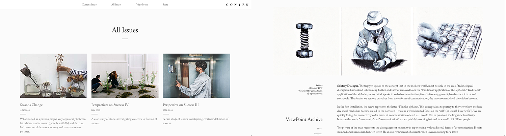
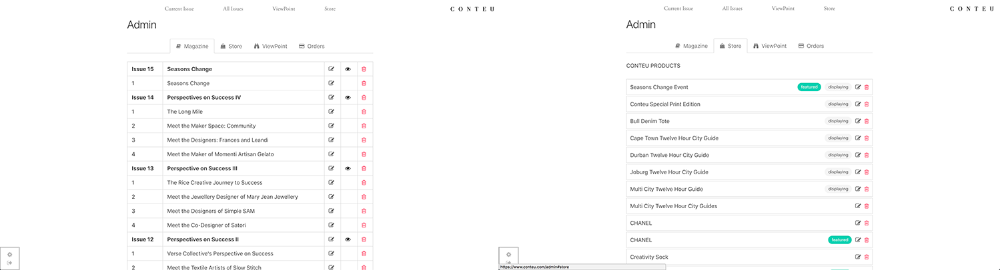

# Conteu Magazine
Online magazine about igniting creativity.
[www.conteu.com](https://www.conteu.com)

### Features:
* Complete Content Management System (custom built using Rails).
* Uses drag and drop style widgets to build up articles.
* Native Store (with custom built cart, inventory management and payment gateway integration).
* Clean UI and Admin screen for managing stories, items on the store and customer orders.
* Optimised for mobile.

#### Frameworks:
* Ruby on Rails
* Slim (HTML Templating)
* Bulma (SCSS)
* JQuery
* Postgres
* Hosted on Heroku

#### Minimalist Design:

#### Clean Admin UI:

